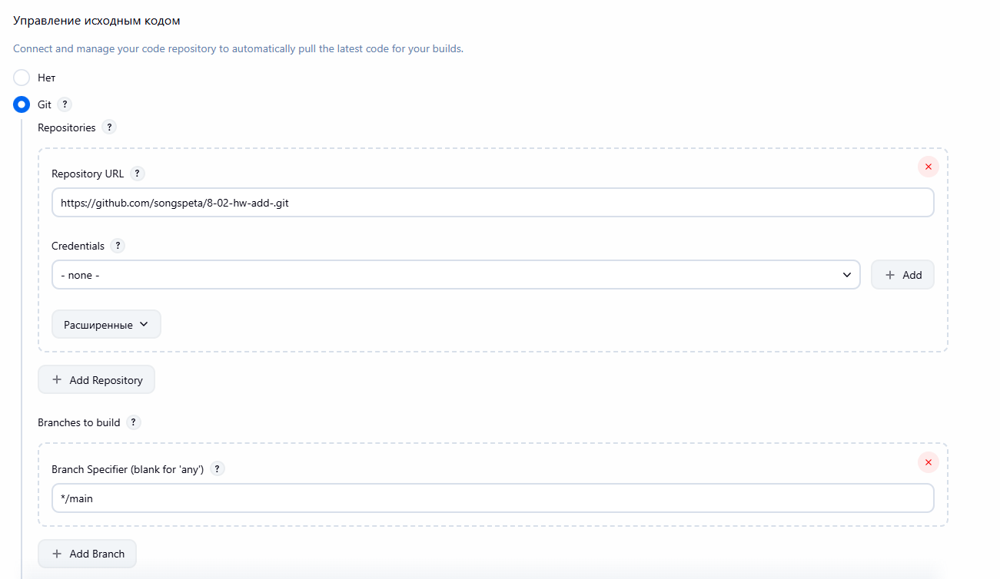
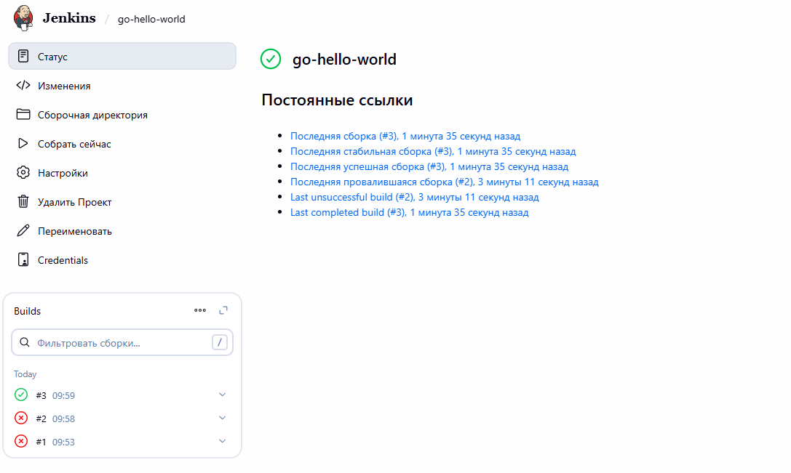
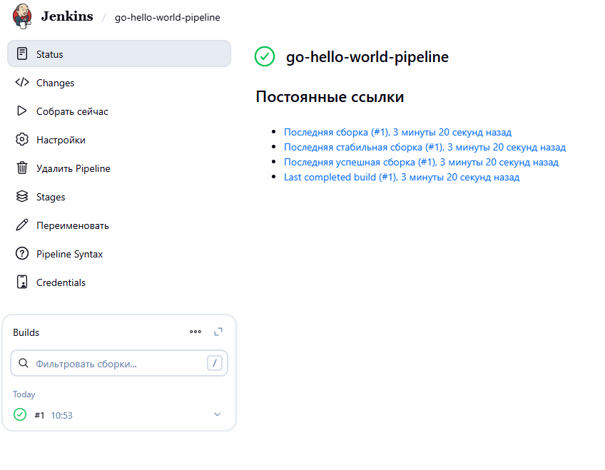
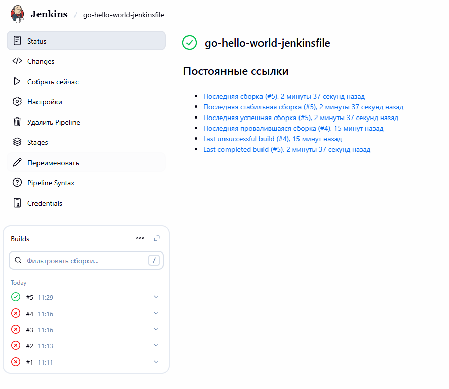
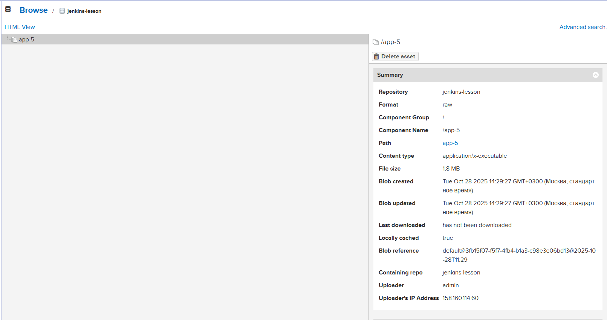

# Домашнее задание к занятию "`Что такое DevOps. СI/СD`" - `Спетницкий Д.И.`


---

### Задание 1

**Что нужно сделать:**

1. Установите себе jenkins по инструкции из лекции или любым другим способом из официальной документации. Использовать Docker в этом задании нежелательно.
2. Установите на машину с jenkins [golang](https://golang.org/doc/install).
3. Используя свой аккаунт на GitHub, сделайте себе форк [репозитория](https://github.com/netology-code/sdvps-materials.git). В этом же репозитории находится [дополнительный материал для выполнения ДЗ](https://github.com/netology-code/sdvps-materials/blob/main/CICD/8.2-hw.md).
4. Создайте в jenkins Freestyle Project, подключите получившийся репозиторий к нему и произведите запуск тестов и сборку проекта ```go test .``` и  ```docker build .```.

В качестве ответа пришлите скриншоты с настройками проекта и результатами выполнения сборки.

---

1. Мы создали 2 машины с помощью [terraform](terraform/) и настроили их с помощью [ansible](ansible/).
2. Установили jenkins и golang.
3. Сделали fork [репозитория](https://github.com/songspeta/8-02-hw-add-.git).
4. Создали в jenkins Freestyle Project


### Скриншоты
#### 1. Подключение к Git-репозиторию

#### 2. Шаги сборки

#### 3. Успешная сборка



---

### Задание 2

**Что нужно сделать:**

1. Создайте новый проект pipeline.
2. Перепишите сборку из задания 1 на declarative в виде кода.

В качестве ответа пришлите скриншоты с настройками проекта и результатами выполнения сборки.

---
Мы создали pipeline script и успешно его выполнения

#### Pipeline
```
pipeline {
    agent any

    stages {
        stage('Checkout') {
            steps {
                git branch: 'main', url: 'https://github.com/songspeta/8-02-hw-add-.git'
            }
        }

        stage('Test') {
            steps {
                sh '/usr/local/go/bin/go test .'
            }
        }

        stage('Build Docker Image') {
            steps {
                sh 'docker build -t hello-world:$BUILD_NUMBER .'
            }
        }
    }
}
```

### Скриншоты
#### 1. Pipeline script

#### 2. Успешная сборка



---

### Задание 3

**Что нужно сделать:**

1. Установите на машину Nexus.
2. Создайте raw-hosted репозиторий.
3. Измените pipeline так, чтобы вместо Docker-образа собирался бинарный go-файл. Команду можно скопировать из Dockerfile.
4. Загрузите файл в репозиторий с помощью jenkins.

В качестве ответа пришлите скриншоты с настройками проекта и результатами выполнения сборки.

---
1. Сделали в первом задании при помощи [terraform](terraform/) и  [ansible](ansible/).
2. Создали raw-hosted репозиторий.


3. [Jenkinsfile](https://github.com/songspeta/8-02-hw-add-/blob/main/Jenkinsfile)

4. 
